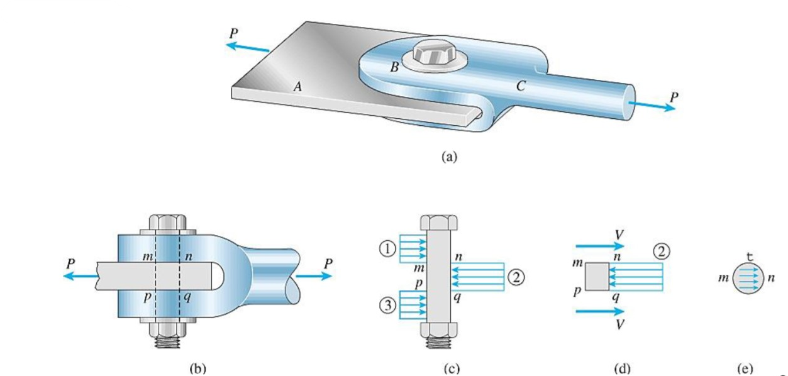

# CH_1

[TOC]

## 1. Stress-strain program

### Elastic behavior

- A straight line
- Stress is proportional to strain
- Upper stress limit $\sigma_{pl}$
- If load is removed upon reaching the limit, specimen will return to its original shape

### Yielding

- Material deforms permanently (plastic deformation)
- Yield strength $\sigma_Y$
- Once the load is removed, specimen continues to elongate without any increase in load
- Materials referred to as being perfectly plastic
- The _torsional force_ cause **the slip line**

### Strain hardening

- Ultimate stress $\sigma_u$
- While specimen is elongated, its x-sectional area will decrease
- Decrease in area is fairly uniform over entire gauge length

### Necking

- At ultimate stress, x-sectional area begins to decrease in a localized region
- Specimen finally breaks at fracture stress $\sigma_f$
