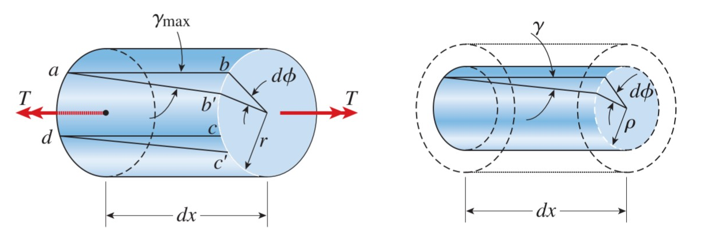

# CH_2

[TOC]

## 2.1 Hooke's Law

$$
\sigma=E\varepsilon=\frac{E\delta}{L}=\frac{P}{A}
$$

- _E_: the modulus of elasticity of Youngs' modulus, which has the stress units
- *$\sigma$*: stress
- *$\varepsilon$*: strain, which equals the ratio of the increasing length of the length

## 2.2 Poison Ratio

$$
\nu=-\frac{\varepsilon'}{\varepsilon}
$$

- $\nu$: Poison Ratio
- $\varepsilon$: axial strain(轴向拉伸)
- $\varepsilon'$: lateral strain(侧向拉伸)

## 2.3 Shear Stress

the stress component that act in the plane of the sectioned area

### Average Bearing Stress

$$
\sigma_b=\frac{F_b}{A_b}
$$

- $F_b$: bearing force
- $A_b$: bearing area

### Average Shear Stress at Section

$$
\tau_{aver}=\frac{V}{A}
$$

- $V$: internal shear force at section determined from equations of equilibrium
- $A$: area of section

#### Single Shear

$$
V=F
$$

#### Double Shear

$$
V=\frac{F}{2}
$$

- Positive strain is when the angle between two positive faces is reduced
- Negative strain is when the angle between two positive faces is increased

### Hooke's Law for Shear

$$
\begin{aligned}
  \tau&=G\gamma\\[2ex]
     G&=\frac{E}{2(1+\nu)}
\end{aligned}
$$

- $G$: shear modulus of elasticity

## 2.4 Allowable Stresses and Allowance Loads

When designing a structural member or mechanical element, the design interest is **strength**, that is _the capacity of the object to support or transmit loads_

- factor of safety (F.S.)

$$
n=\frac{\text{Actual Strength}}{\text{Required Strength}}
$$

- allowable strength
  
  

## 2.5 Design for Axial Loads and Direct Shear

- determine the area of section subjected to a normal force

$$
A=\frac{P}{\sigma_{allow}}
$$

- determine the area of section subjected to a shear force

$$
A=\frac{V}{\tau_{allow}}
$$

## 2.6 Changes in Lengths of An Axially Loaded Members

$$
P=k\delta\qquad\delta=fP\\[2ex]
k\text{ is the stiffness of the spring}\\[2ex]
f\text{ is the flexibility of the spring}\\[2ex]
$$

- **stiffness**: is the force required to produce a unit elongation
- **flexibility**: is the elongation produced by a unit force

$$
\begin{cases}
    \delta = L\cdot \varepsilon\\[2ex]
    \sigma = E\cdot \varepsilon\\[2ex]
    P =\sigma \cdot A
\end{cases}\\[6ex]
\Rightarrow\;\delta=\frac{L}{EA}P\\[2ex]
$$

### Sign Convention

|    Sign     |   Forces    | Displacement |
| :---------: | :---------: | :----------: |
| Positive(+) |   Tension   |  Elongation  |
| Negative(-) | Compression | COntraction  |

### Use Method of Sections

$$
\begin{cases}
    \sigma=\frac{P(x)}{A(x)}=E\varepsilon\\[2ex]
    \varepsilon=\frac{d\delta}{dx}
\end{cases}\\[6ex]
\Rightarrow d\delta = \frac{P(x)}{A(x)E}dx\\[2ex]
\delta=\int_{0}^{L}{\frac{P(x)}{A(x)E}dx}
$$

- $P(x)$: internal normal force at the section, located a distance x from one end
- $A(x)$: x-sectional area of the bar, expressed as a function of x

**Constant Load and x-Sectional Area**

$$
\delta=\frac{L}{EA}P
$$

**Bars with Intermediate Axial Loads**

$$
\delta=\sum{\frac{L}{EA}P}
$$

## 2.7 Statically Indeterminate Structures

if the bar is **fixed at both ends**, then the unknown axial reactions occur, and the bar is statically indeterminate.

$$
\begin{split}
\delta_{A/B}=0\\[2ex]
\frac{F_AL_{AC}}{AE}-\frac{F_BL_{CB}}{AE}=0\\[2ex]
\end{split}\\[6ex]
\Rightarrow F_A=P(\frac{L_CB}{L})\qquad F_B=P(\frac{L_AC}{L})
$$

## 2.8 Thermal Stress

expansion or contraction of material is linearly related to temperature increase or decrease that occurs

$$
\varepsilon_T=\alpha\Delta T\qquad \delta_T =\alpha \Delta TL
$$

$\alpha$: liner coefficient of thermal expansion