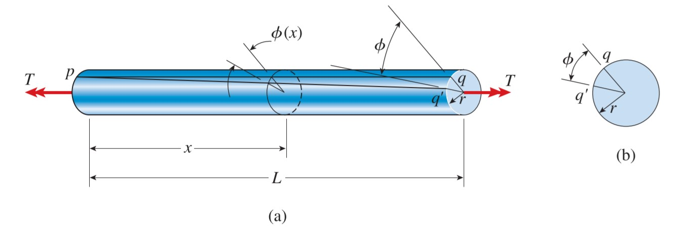

# CH_3

[Toc]

## 3.1 Introduction 

### Torsion

the twisting of a straight bar when it is loaded by moment (or torque) that tends to produce rotation about the longitudinal axis of the bar

### Torque 

a moment that twists/deforms a member about its longitudinal axis

### Shaft

cylindrical members that are subjected to torques and transmit power through rotation

## 3.2 Torsional Deformation of a Circular Bar

### Pure Torsion

the bar is in pure torsion when every cross section of the bar is identical and subjected to the same internal torque *T*

### Angle of Twist

under the action of the torque *T*, the right-hand end will rotate (with respect to the left-handed) through a small angle $\phi$

### Shear Strain at the Outer Surface

$$
\begin{split}
    \gamma_{max}&=\frac{bb'}{ab}\\[2ex]
    \Rightarrow\quad\gamma_{max}&=\frac{r\mathrm{d}\phi}{\mathrm{d}x}\\[2ex]
\end{split}
$$
denote the symbol $\theta$ as the **rate of twist**
$$
\begin{aligned}    
    \theta&=\frac{\mathrm{d}\phi}{\mathrm{d}x}\\[2ex]
    \Rightarrow\quad\gamma_{max}&=r\theta
\end{aligned}
$$

**for pure torsion only**, we can obtain that 
$$\gamma_{max}=\frac{r\phi}{L}$$

### Shear Strain within the bar

$$
\gamma= \rho \theta=\frac{\rho}{r}\gamma_{max}
$$

### Circular Tube

$$
\gamma_{max}=\frac{r_2 \phi}{L}\qquad\gamma_{min}=\frac{r_1}{r_2}\gamma_{max}=\frac{r_2 \phi}{L}
$$

## 3.3 Circular Bars of Linearly Elastic Materials

**the shear stresses acting on a cross-sectional plane are accompanied by shear stresses of the same magnitude acting on longitudinal planes.**

### the Torsion Formula

$$
\mathrm{d}M=\tau \rho \mathrm{d}A=\frac{\tau_{max}}{r}\rho^2\mathrm{d}A\\[2ex]
\text{the resultant moment is the summation over the entire cross-sectional area}\\[2ex]
T=\int_A{\mathrm{d}M}=\frac{\tau_{max}}{r}\int_A{\rho^2\mathrm{d}A}\\[4ex]
\text{in which}\\[2ex]
I_P=\int_A{\rho^2\mathrm{d}A}
$$

is the **polar moment of inertia** of the circular cross section

The shear stress at distance ρ from the center of the bar is
$$
\tau_{max}=\frac{Tr}{I_P}\tag{torsion formula}
$$

### Angle of Twist

according to Hooke's Law in shear

$$
\tau = G\gamma=G\rho\theta=\frac{\rho}{r}\tau_{max}
$$

using the torsion formula

$$
G\rho\theta=\frac{\rho}{r}\frac{Tr}{I_P}\\[2ex]
\theta=\frac{T}{GI_P}
$$

for a bar in pure torsion, the total angle og the twist $\phi$, equal to the rate of twist time the length of the bar

$$
\phi = \frac{TL}{GI_P}
$$

### Torsional Stiffness and Torsional Flexibility

$$
k_T=\frac{GI_P}{L}\qquad f_T=\frac{L}{GI_P}
$$