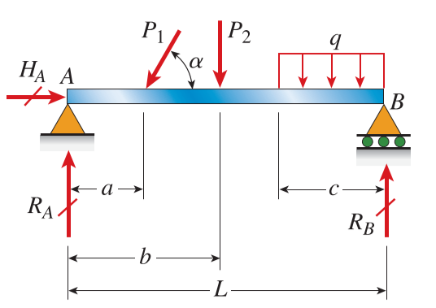
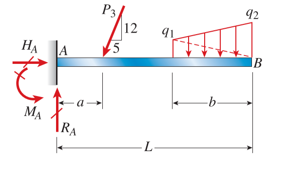
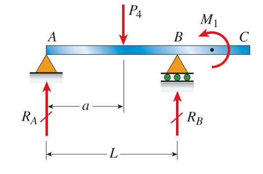
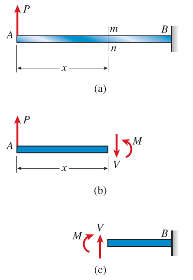
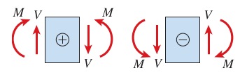
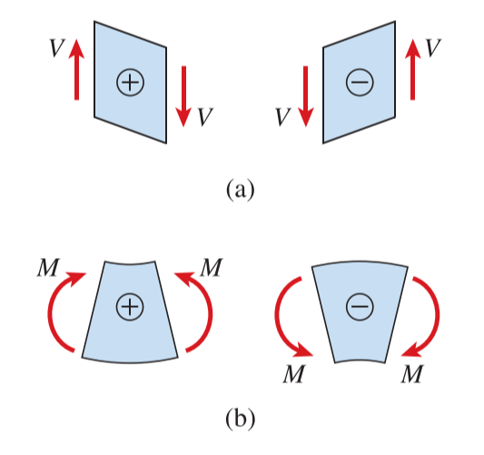
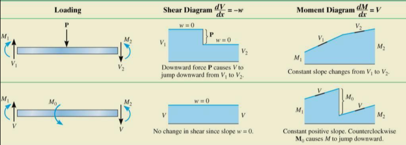
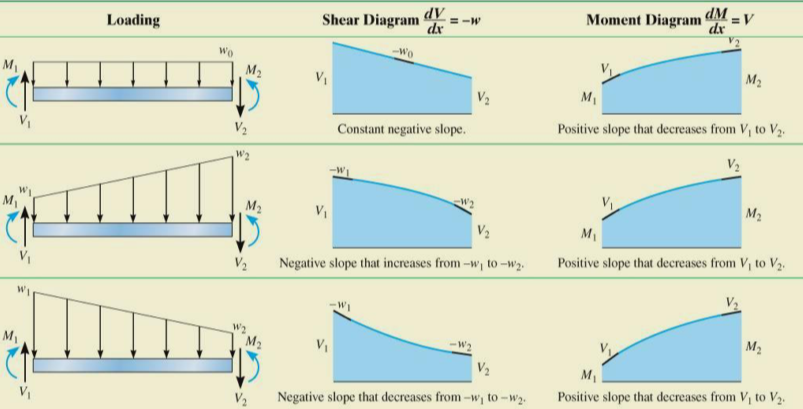

# CH_4

[TOC]

## 4.1 Types if Beams, Loads and Reactions

### Simple Beam

### Cantilever Beam

### Beam with an Overhang

## 4.2 Shear Forces and Bending Bending Moments

$$
\begin{aligned}
    \sum{F_{vert}}&=0\qquad P-V = 0\\[2ex]
    \sum{M}&=0\qquad M-Px = 0\\[2ex]
\end{aligned}
$$

### Sign Convention

## 4.3 Relationship between Loads, Shear forces, and Bending Moments

### Regions of Distributed Load

$$
\begin{aligned}
    \frac{\mathrm{d}V}{\mathrm{d}x}=-w(x)&\qquad \frac{\mathrm{d}M}{\mathrm{d}x}=V\\[2ex]
    \Delta V = \int{-w(x)\mathrm{d}x}&\qquad \Delta M=\int{V\mathrm{d}x}
\end{aligned}
$$

### Shear Diagram

