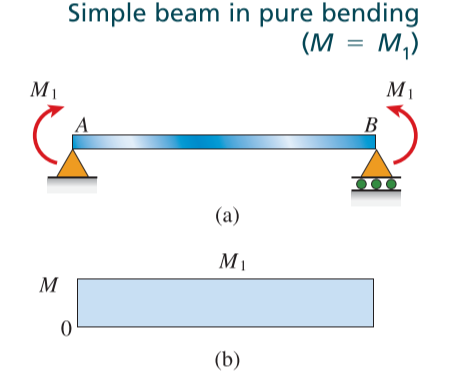
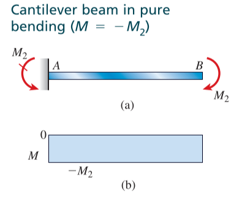
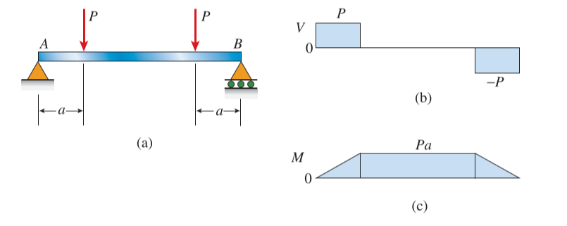
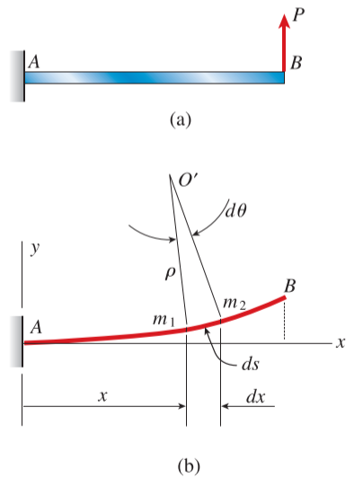
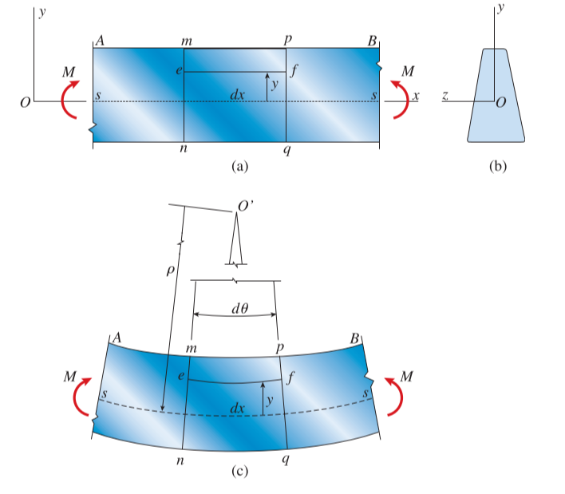
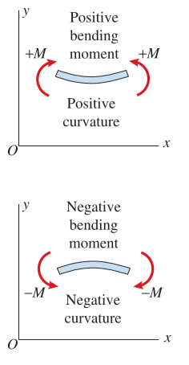
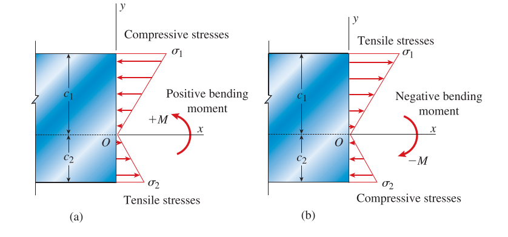

# CH_5

[TOC]

## 5.1 Pure Bending and Nonuniform Bending

### Pure Bending

the flexure of a beam under a constant bending moment

### Nonuniform Bending

the flexure in the presence of shear forces

     

    

## 5.2 Curvature of a Beam

$$
\begin{aligned}
    \rho \mathrm{d}\theta &= \mathrm{d}s\\[2ex]
    \kappa = \frac{1}{\rho}&=\frac{\mathrm{d}\theta}{\mathrm{d}s}\\[2ex]
    &=\frac{\mathrm{d}\theta}{\mathrm{d}x}
\end{aligned}
$$

## 5.3 Longitudinal Strains in Beams

$$
\begin{aligned}
    \overset{\Large{\frown}}{ef}=(\rho-y)\mathrm{d}\theta &\qquad\mathrm{d}x=\rho \mathrm{d}\theta\\[2ex]
    \varepsilon=\frac{\overset{\Large{\frown}}{ef}-\mathrm{d}x}{\mathrm{d}x}&=-\frac{y}{\rho}
\end{aligned}
$$

## 5.4 Normal Stress in Beams

$$
\sigma_x=E\varepsilon_x=\frac{Ey}{\rho}=-E\kappa y
$$

### Location of Neutral Axis

$$
    \int_A{\sigma_x\mathrm{d}A}=-\int_A{E\kappa y\mathrm{d}A}=0\\[2ex]
    \int_A{y\mathrm{d}A}=0
$$

### Moment Curvature Relationship

$$
\begin{aligned}
    \mathrm{d}M&=-\sigma_xy \mathrm{d}A\\[2ex]
    M &= -\int_A{\sigma_x y\mathrm{d}A}\\[2ex]
      &= \int_A{\kappa Ey^2\mathrm{d}A}=\kappa E\int_A{y^2\mathrm{d}A}\\[2ex]
      &= \kappa EI\\[2ex]
    \kappa &=\frac{1}{\rho}=\frac{M}{EI}
\end{aligned}
$$

### Flexure Formula

**bending stresses** (flexure stresses)

$$
\sigma_x=-\frac{My}{I}
$$

    
    

> For positive moment: $\sigma_c = -\frac{M\bar{y}}{I}$ $\sigma_t = - \frac{M(\bar{y}-h)}{I}$
> For negative moment: $\sigma_c = -\frac{M(\bar{y}-h)}{I}$ $\sigma_t = - \frac{M\bar{y}}{I}$
>

### Maximum Stresses at a Cross Section

the *maximum tensile* and *compressive bending stresses* acting at any given cross section occur at points **located farthest from the neutral axis**

$$
\begin{aligned}
    \sigma_{max}&=-\frac{Mc}{I}=-\frac{M}{S}\\[2ex]
    S&=\frac{I}{c}
\end{aligned}
$$

where S is known as the **section moduli** of the cross-sectional area

### Doubly Symmetric Shapes

#### Rectangular Cross Section

$$
I = \frac{bh^3}{12}\qquad S=\frac{bh^2}{6}
$$

#### Circular Cross Section

$$
I=\frac{\pi d^4}{64}\qquad S=\frac{\pi d^3}{32}
$$

## 5.8 Shear Stresses in Rectangular Beams

### Shear Formula

$$
\tau = \frac{VQ}{I_zb}
$$

- V: internal resultant shear force
- I: moment of inertia of entire x-sectional area computed about the neutral axis
- b: width of the member's x-sectional area, measured at the pt where $\tau$ is to be determined
- Q: $\frac{1}{2}b(\frac{h^2}{4}-y^2)$, where y is measured from neutral axis

$$
\tau = \frac{6V}{bh^3}(\frac{h^2}{4}-y^2)
$$