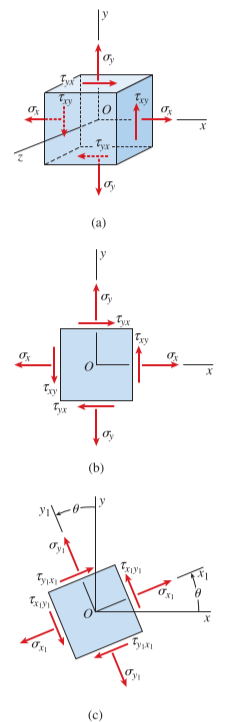
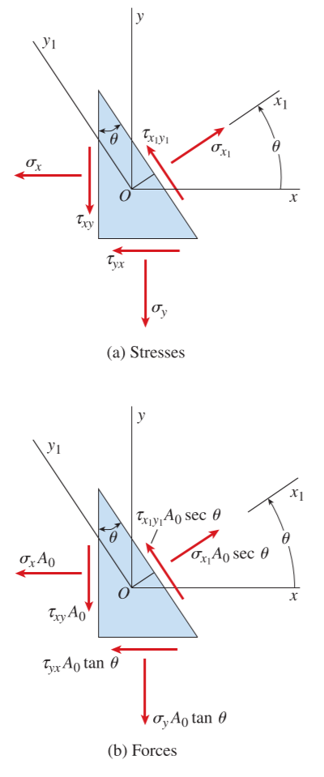
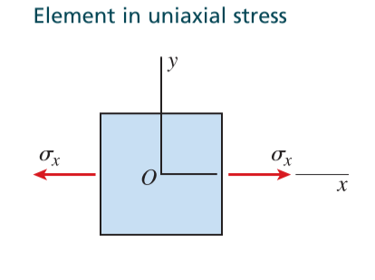
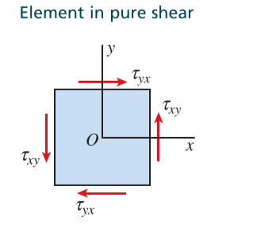
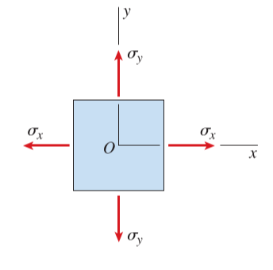

# CH_7

[TOC]

## 7.1 Plane Stress

bars in tension and compression, shafts in torsion, and beams in bending are examples of a state of stress called **plane stress**

- **Normal Stress**: has a subscript that identifies the face on which the stress acts. For example: $\sigma_x$ and $\sigma_y$
- **Shear Stress**: has two subscripts: the first denotes the face on which the stress acts, and the second gives the direction on that face. For example: $\tau_{xy}$ and $\tau_{yx}$
- **Sign Convention for Shear Stresses**: a shear stress is positive when the directions associated with its subscripts are plus-plus or minus-minus; the stress is negative when the directions are plus-minus or minus-plus.

$$
\tau_{xy}=\tau_{yx}
$$

### Transformation Equations for Plane Stress

$$
\begin{aligned}
\sigma_{x1}&=\frac{\sigma_x+\sigma_y}{2}+\frac{\sigma_x-\sigma_y}{2}\cos{2\theta}+\tau_{xy}\sin{2\theta}\\[2ex]
\sigma_{y1}&=\frac{\sigma_x+\sigma_y}{2}-\frac{\sigma_x-\sigma_y}{2}\cos{2\theta}-\tau_{xy}\sin{2\theta}\\[2ex]
\tau_{x_1y_1}&=-\frac{\sigma_x-\sigma_y}{2}\sin{2\theta}+\tau_{xy}\cos{2\theta}
\end{aligned}
$$

### Special Cases of Plane Stress

#### Uniaxial Stress

$$
\sigma_{x_1}=\frac{\sigma_x}{2}(1+\cos{2\theta})\qquad \tau_{x_1y_1}=-\frac{\sigma_x}{2}\sin{2\theta}
$$

#### Pure Shear

$$
\sigma_{x_1}=\tau_{xy}\sin{2\theta}\qquad \tau_{x_1y_1}=\tau_{xy}\cos{2\theta}
$$

#### Biaxial Stress

$$
\begin{aligned}
\sigma_{x_1}&=\frac{\sigma_x+\sigma_y}{2}+\frac{\sigma_x-\sigma_y}{2}\cos{2\theta}\\[2ex]
\tau_{x_1y_1}&=-\frac{\sigma_x-\sigma_y}{2}\sin{2\theta}
\end{aligned}
$$

## 7.2 Principal Stresses and Maximum Shear Stresses

### Principal Stresses

$$
\frac{\mathrm{d}\sigma_{x_1}}{\mathrm{d}\theta}=-(\sigma_x-\sigma_y)\sin{2\theta}+2\tau_{xy}\cos{2\theta}=0\\[2ex]
\tan{2\theta_p}=\frac{2\tau_{xy}}{\sigma_x-\sigma_y}
$$

Define $R = \sqrt{\Big(\frac{\sigma_x-\sigma_y}{2}\Big)^2+\tau_{xy}^2}$, then $\cos 2\theta_p=\frac{\sigma_x-\sigma_y}{2R}\quad \sin 2\theta_p=\frac{\tau_{xy}}{R}$

then $\sigma_1$ is denoted as:

$$
\begin{aligned}
\sigma_1 &= \frac{\sigma_x+\sigma_y}{2}+\frac{\sigma_x-\sigma_y}{2}\cos 2\theta_p+\tau_{xy}\sin 2\theta_p\\[2ex]
    &= \frac{\sigma_x+\sigma_y}{2}+\frac{\sigma_x-\sigma_y}{2}\frac{\sigma_x-\sigma_y}{2R}+\tau_{xy}\frac{\tau_{xy}}{R}\\[2ex]
    &= \frac{\sigma_x+\sigma_y}{2}+\sqrt{\Big(\frac{\sigma_x-\sigma_y}{2}\Big)^2+\tau_{xy}^2}
\end{aligned}
$$

and $\sigma_1+\sigma_2=\sigma_x+\sigma_y$, then $\sigma_2$ is denoted as

$$
\begin{aligned}
\sigma_2 &= \sigma_x+\sigma_y-\sigma_1\\[2ex]
         &= \frac{\sigma_x+\sigma_y}{2}-\sqrt{\Big(\frac{\sigma_x-\sigma_y}{2}\Big)^2+\tau_{xy}^2}
\end{aligned}
$$

where $\sigma_1$ and $\sigma_2$ are the principle stresses

### Principle Angles

$$
\cos 2\theta_{p1}=\frac{\sigma_x-\sigma_y}{2R} \qquad \sin2\theta_{p1}=\frac{\tau_{xy}}{R}
$$

the value is unique for $\theta_{p1}$, and the angle for $\theta_{p2}$ is perpendicular to the previous one, which is 90 degree larger or less than $\theta_{p1}$

### Shear Stresses

shear stresses are zero on the principle planes

### Special Cases

- uniaxial stress (biaxial stress): $\tan2\theta_p = 0$
- pure shear: $\tan 2\theta_p = \infty$, stresses come to $\sigma_1 = \tau_{xy}$ and $\sigma_2 = -\tau_{xy}$

### Maximum Shear Stresses

similar to the principle stresses

$$
\frac{\mathrm{d}\tau_{xy}}{\mathrm{d}\theta}=-(\sigma_x-\sigma_y)\cos{2\theta}+2\tau_{xy}\sin{2\theta}=0\\[2ex]
\tan{2\theta_s}=-\frac{\sigma_x-\sigma_y}{2\tau_{xy}}
$$

since $\tan2\theta_p = \frac{2\tau_{xy}}{\sigma_x-\sigma_y}$, then $\cos(2\theta_s-2\theta_p)=0$

$$
\theta_s = \theta_p \pm 45^{\circ}\\[2ex]
\sigma_{s_1}=\theta_{p_1}-45^{\circ}\\[2ex]
\tau_{max} = \sqrt{\Big(\frac{\sigma_x-\sigma_y}{2}\Big)^2+\tau_{xy}^2}=\frac{\sigma_1-\sigma_2}{2}\\[2ex]
\sigma_{aver}=\frac{\sigma_x+\sigma_y}{2}
$$