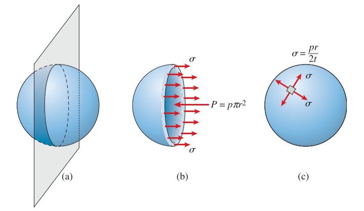
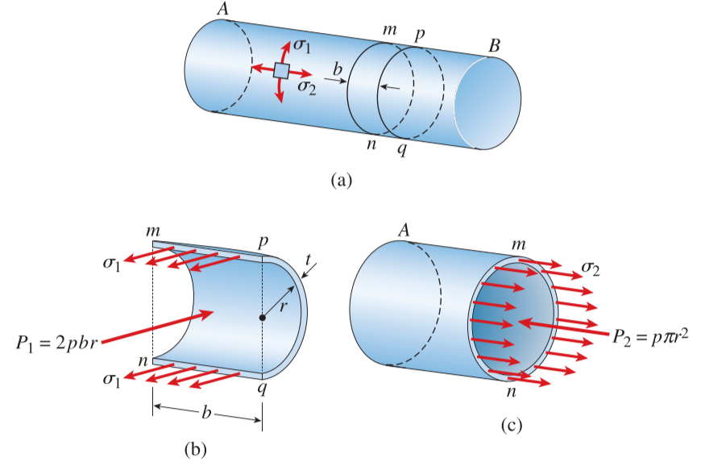

# CH_8

[TOC]

## 8.1 Spherical Pressure Vessels

### Definition

pressure vessels are closed structures containing liquids or gases under pressure

according to the above figure

$$
\begin{aligned}
    p\pi r^2 &= \sigma (2\pi rt)\\[2ex]
    \sigma &= \frac{pr}{2t}\\[2ex]
\end{aligned}
$$

### Stresses at the Outer Surface

every plane of the vessel is a principle plane and every direction is a principle direction

$$
\sigma_1 = \sigma_2 =\frac{pr}{2t}\\[2ex]
$$

and the maximum shear stresses is made by 45 degree rotation

$$
\tau_{max} = \frac{\sigma}{2} = \frac{pr}{4t}
$$

### Stresses at the Inner Surface

the principle stresses are the same

$$
\sigma_1 = \sigma_2 =\frac{pr}{2t}\\[2ex]
$$

the in-plane shear stresses are zero, but the maximum out-of-plane shear stress is

$$
\tau_{max} = \frac{\sigma+p}{2}=\frac{pr}{4t}+\frac{p}{2}
$$

## 8.2 Cylindrical Pressure Vessels

### Circumferential Stress

$$
\sigma_1(2bt)-2pbr=0\\[2ex]
\sigma_1 = \frac{pr}{t}
$$

### Longitudinal Stress

$$
\sigma_2(2\pi rt)-p\pi r^2=0\\[2ex]
\sigma_2 = \frac{pr}{2t}
$$

### Stresses at the Outer Surface

the absolute maximum shear stress is

$$
\tau_{max} = \frac{\sigma_1}{2}=\frac{pr}{2t}
$$

#### in-plane shear stresses

$$
(\tau_{max})_z = \frac{\sigma_1-\sigma_2}{2}=\frac{\sigma_1}{4} =\frac{pr}{4t}\\[2ex]
$$

#### out-of-plane shear stresses

$$
(\tau_{max})_x = \frac{\sigma_1}{2}=\frac{pr}{2t}\quad (\tau_{max})_y=\frac{\sigma_2}{2}=\frac{pr}{4t}
$$

### Stresses at the Inner Surface 

$$
\sigma_1 = \frac{pr}{t} \quad \sigma_2 = \frac{pr}{2t}\quad \sigma_3 = -p
$$

$$
(\tau_{max})_x = \frac{\sigma_1-\sigma_3}{2}=\frac{pr}{2t}+\frac{p}{2}\\[2ex]
(\tau_{max})_y = \frac{\sigma_2-\sigma_3}{2}=\frac{pr}{4t}+\frac{p}{2}\\[2ex]
(\tau_{max})_z = \frac{\sigma_1-\sigma_2}{2}=\frac{pr}{4t}\\[2ex]
$$

## 8.3 Maximum Stresses in Beams

$$
\sigma =-\frac{My}{I} \qquad \tau = \frac{VQ}{Ib}
$$

## 8.4 Combined Loadings

1. Select a point in the structure where the stresses and strains are to be determined. (The point is usually selected at a cross section where the stresses are large, such as at **a cross section where the bending moment has its maximum value**.)
2. For each load on the structure, determine the stress resultants at the cross section containing the selected point. (The possible stress resultants are an axial force, a twisting moment, a bending moment, and a shear force.)
3. Calculate the normal and shear stresses at the selected point due to each of the stress resultants. Also, if the structure is a pressure vessel, determine the stresses due to the internal pressure. $\sigma=P/A\quad \tau=T\rho/I_P\quad \sigma=My/I \quad \tau = VQ/Ib \quad \sigma = pr/t$
4. Combine the individual stresses to obtain the resultant stresses at the selected point. In other words, obtain the stresses $\sigma_x$, $\sigma_y$, and $\tau_{xy}$ acting on a stress element at the point. (Note that in this chapter we are dealing only with elements in plane stress.)
5. Determine the principal stresses and maximum shear stresses at the selected point, using either the stress-transformation equations or Mohr’s circle. If required, determine the stresses acting on other inclined planes.
6. Determine the strains at the point with the aid of Hooke’s law for plane stress.
7. Select additional points and repeat the process. Continue until enough stress and strain information is available to satisfy the purposes of the analysis.