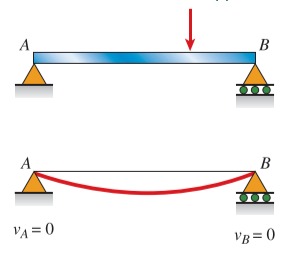
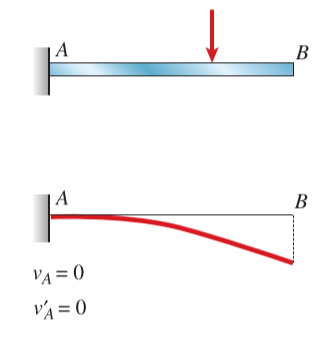
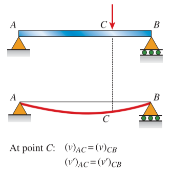
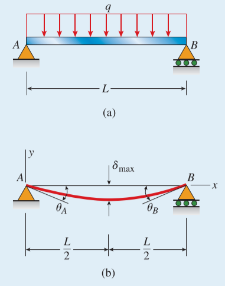

# CH_9

[TOC]

## 9.1 Introduction

### Deflection Curve

definition: the axis is deformed to into a curve while loading by a lateral forces

## 9.2 Differential Equations of The Deflection Curve

### Beams with Small Angles of Rotation

$$
\begin{aligned}
    \kappa&=\frac{1}{\rho}=\frac{\mathrm{d}\theta}{\mathrm{d}x}\\[2ex]
    \theta&\approx\tan\theta=\frac{\mathrm{d}v}{\mathrm{d}x}\\[2ex]
    \kappa&=\frac{1}{\rho}=\frac{\mathrm{d}\theta}{\mathrm{d}x}=\frac{\mathrm{d}^2v}{\mathrm{d}x^2}\\[2ex]
    \kappa&=\frac{1}{\rho}=\frac{M}{EI}\\[2ex]
    \frac{\mathrm{d}^2v}{\mathrm{d}x^2}&=\frac{M}{EI}\\[2ex]
\end{aligned}
$$

### Nonprismatic Beams

In the case of a nonprismatic beam, the flexural rigidity $EI$ is variable, and therefore

$$
\begin{aligned}
    EI_x \frac{\mathrm{d}^2v}{\mathrm{d}x^2}&=M\\[2ex]
    \frac{\mathrm{d}}{\mathrm{d}x}(EI_x \frac{\mathrm{d}^2v}{\mathrm{d}x^2})&=\frac{\mathrm{d}M}{\mathrm{d}x}=V\\[2ex]
    \frac{\mathrm{d}^2}{\mathrm{d}x^2}(EI_x \frac{\mathrm{d}^2v}{\mathrm{d}x^2})&=\frac{\mathrm{d}V}{\mathrm{d}x}=-q
\end{aligned}
$$

### Prismatic Beams

In the case of a prismatic beam, the flextural rigidity is constant, and therefore

$$
\begin{aligned}
    EI \frac{\mathrm{d}^2v}{\mathrm{d}x^2}=M\qquad EI \frac{\mathrm{d}^3v}{\mathrm{d}x^3}=V\qquad EI \frac{\mathrm{d}^2v}{\mathrm{d}x^2}=-q\\[2ex]
    EIv''=M\qquad EIv''' = V\qquad EI v'''' = -q
\end{aligned}
$$

### Exact Expression for Curvature

Like the curvature in calculus, the exact expression can be written as

$$
\kappa = \frac{1}{\rho}=\frac{v''}{[1+(v')^2]^{3/2}}
$$

## 9.3 Deflections by Integration of the Bending-Moment Equation

### Boundary Conditions

the deflections and slope at the supports of a beam

### Continuity Conditions

occur at points where the regions of integration meet

### Symmetry Conditions

the beam is loaded by uniformly distributed

