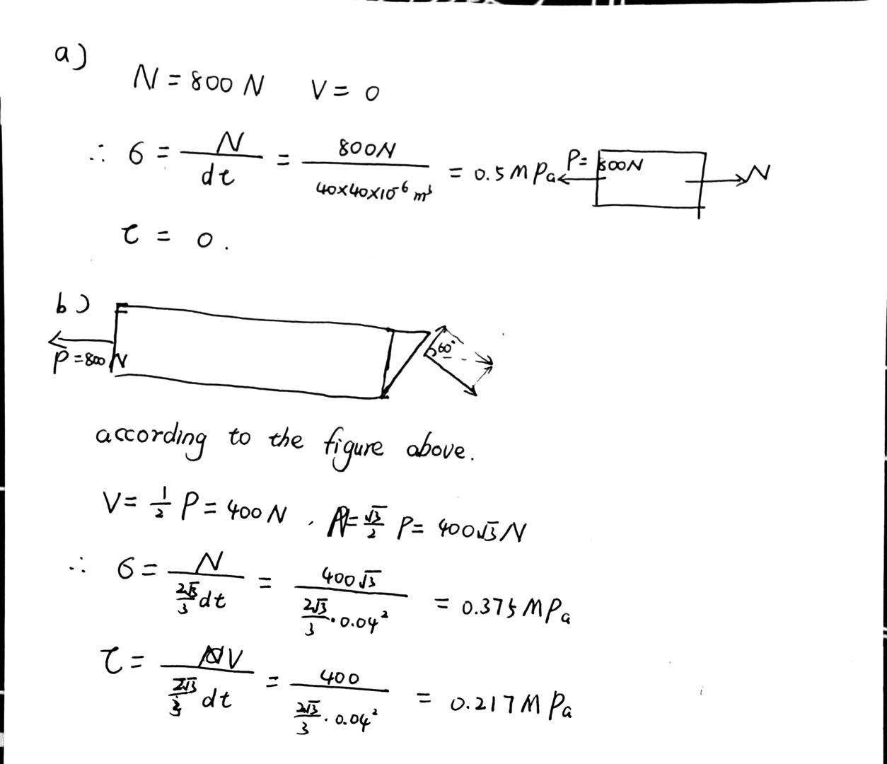
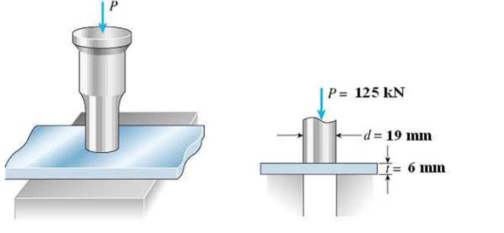
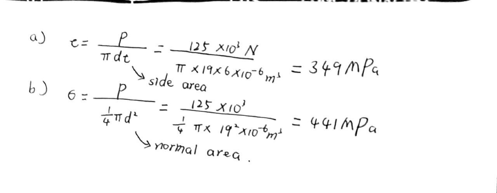
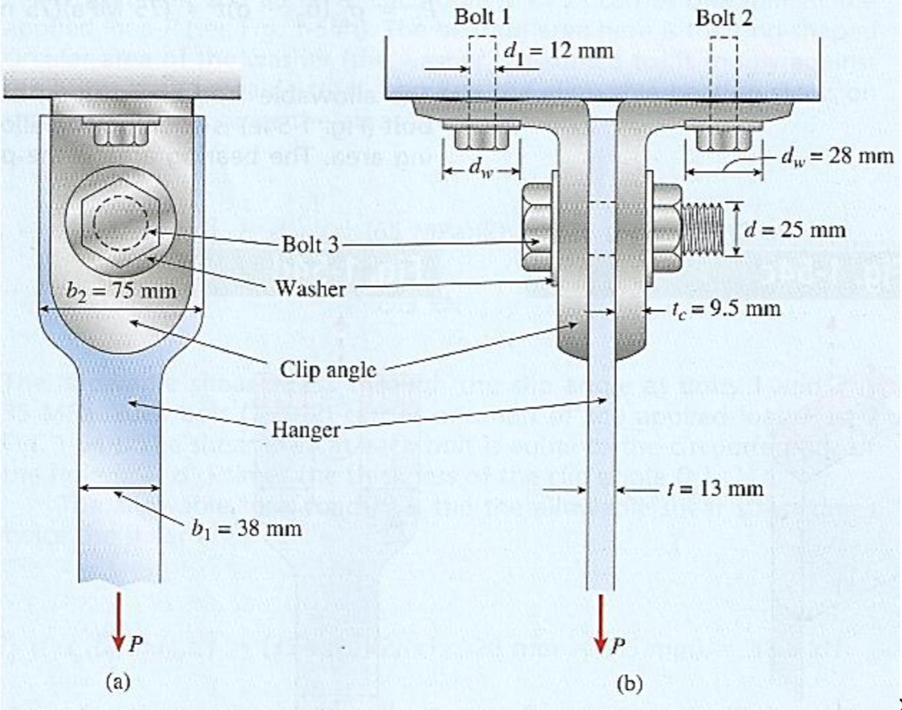
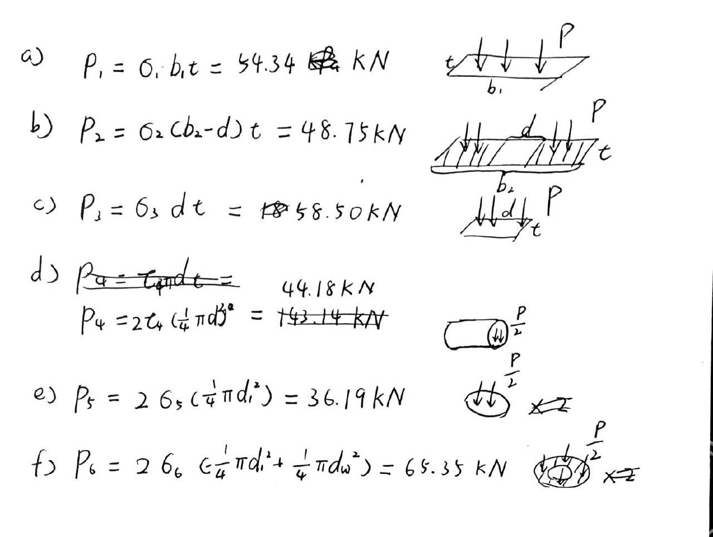
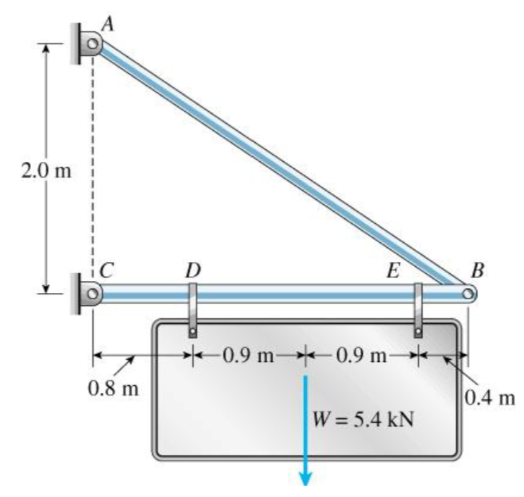
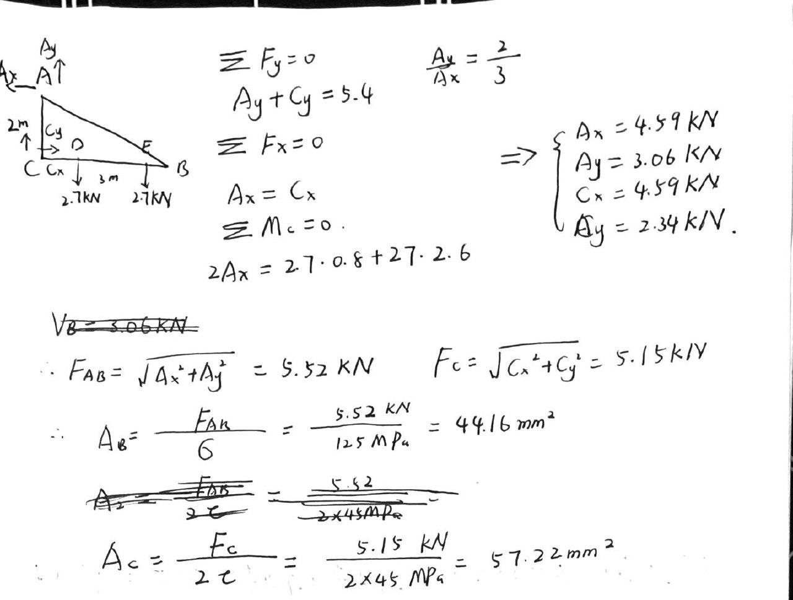

# EX_1

[TOC]

## Ex 1.1

Determine internal forces acting on cross section at C of beam

## Ex 1.2

Determine internal forces acting on cross section at B of pipe

mass of pipe = 2kg/m

## Ex 1.3

Determine the resultant loadings acting on the cross section at G of the wooden beam shown in the following figure. Assume the joints at A, B, C, D and E are pin connected

## Ex 1.4

bar width = 35 mm, thickness = 10 mm

Determine max, average normal stress in bar when subjected to loading shown

## Ex 1.5 (specific weight skipped)

## Ex 1.6

Rod below is subjected to temperature increase along its axis, creating a normal strain of $\varepsilon_z = 40(10^{-3})z^{1/2}$, where z is given in meters.

Determine

- (a) displacement of end B of rod due to temperature increase
- (b) average normal strain in the rod

## Ex 1.7 (the stress-strain diagram skipped)

## Ex 1.8

Depth and thickness = 40 mm 

Determine average normal stress and average shear stress acting along (a) section planes a-a, and (b) section plane b-b

## Ex 1.9

Punching a hole in a steel plate. If force P =125 kN is required to create the hole, what is (a) the average shear stress in the plate and (b) the average compressive stress in the punch

## Ex 1.10

Vertical hanger subjected to a tensile load P

The allowable tensile load, P based on six considerations: 
- (a) The allowable tensile stress in the main part of the hanger is 110 MPa.
- (b) The allowable tensile stress in the hanger at its cross section through the bolt 3 hole is 75 MPa.
- (c) The allowable bearing stress between the hanger and the shank of bolt 3 is 180 MPa.
- (d) The allowable shear stress in the bolt 3 is 45 MPa. 
- (e) The allowable normal stress in bolt 1 and 2 is 160 MPa.
- (f) The allowable bearing stress between the washer and the clip angle at either bolt 1 or 2 is 65 MPa.

## Ex 1.11

Two-bar truss ABC supporting a sign of weight W. 

Allowable stresses in: Tension = 125MPa, Shear = 45MPa

- The required area for member AB
- The required diameter of the pin at support C

