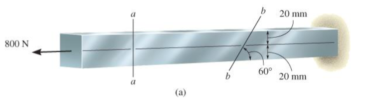

# EX_1

[TOC]

## Ex 1.1

Determine internal forces acting on cross section at C of beam

## Ex 1.2

Determine internal forces acting on cross section at B of pipe

mass of pipe = 2kg/m

## Ex 1.3

Determine the resultant loadings acting on the cross section at G of the wooden beam shown in the following figure. Assume the joints at A, B, C, D and E are pin connected

## Ex 1.4

bar width = 35 mm, thickness = 10 mm

Determine max, average normal stress in bar when subjected to loading shown

## Ex 1.5 (specific weight skipped)

## Ex 1.6

Rod below is subjected to temperature increase along its axis, creating a normal strain of $\varepsilon_z = 40(10^{-3})z^{1/2}$, where z is given in meters.

Determine

- (a) displacement of end B of rod due to temperature increase
- (b) average normal strain in the rod

## Ex 1.7 (the stress-strain diagram skipped)

## Ex 1.8

Depth and thickness = 40 mm 

Determine average normal stress and average shear stress acting along (a) section planes a-a, and (b) section plane b-b

