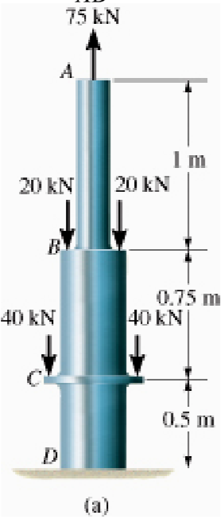
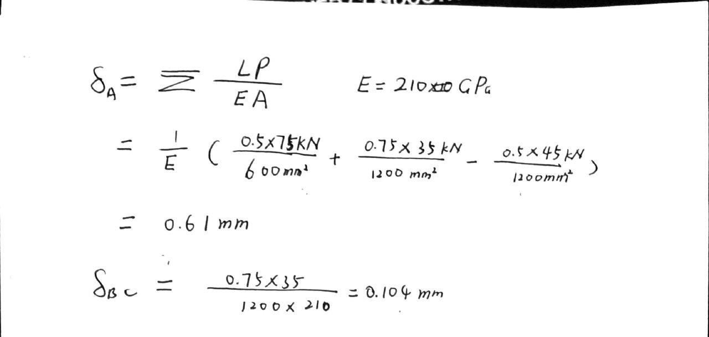
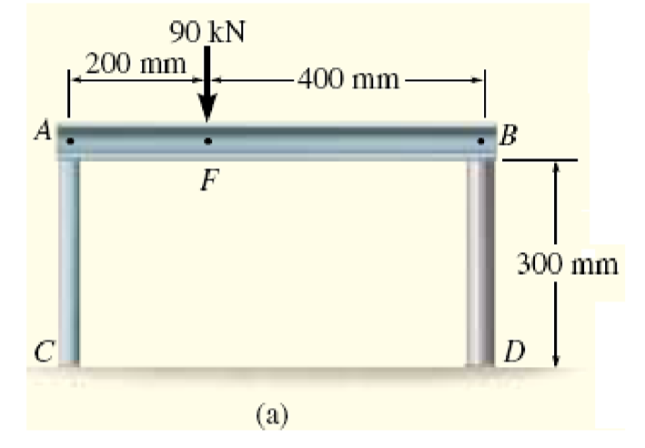
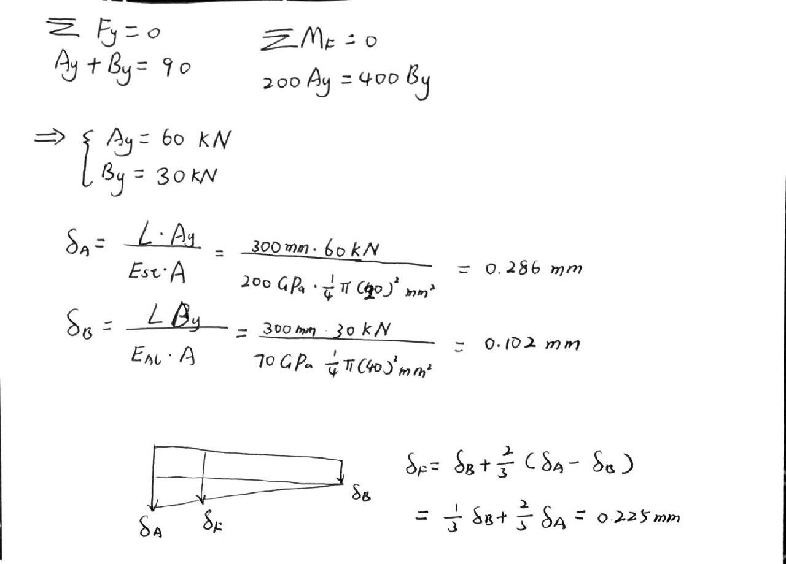
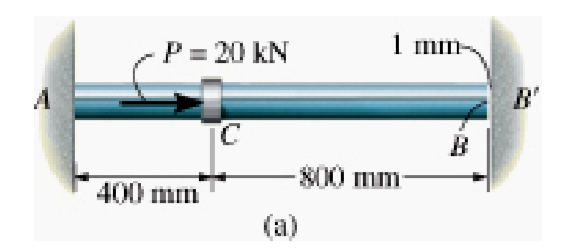
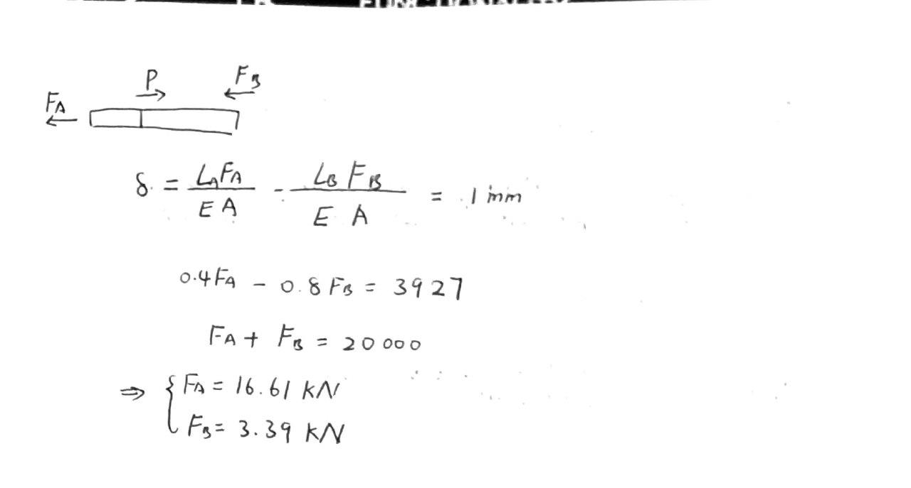
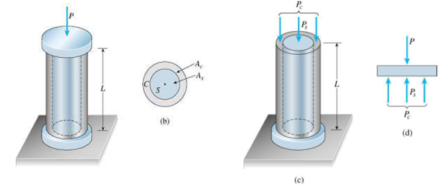
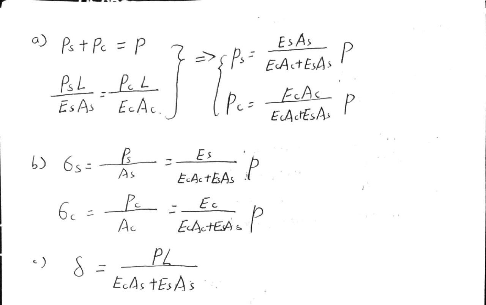

# EX_2

[TOC]

## EX 2.1

The composite A-36 steel bar shown made from two segments AB and BD. Cross section area $A_{AB} = 600 mm^2$ and $A_{BD} = 1200 mm^2$.

Determine the vertical displacement of end A and displacement of B relative to C.

## EX 2.2

A rigid beam AB rests on the two short posts. AC is made of steel and has a diameter of 20 mm, and BD is made of aluminum and has a diameter of 40 mm. Take $E_{st}=200GPa$, $E_{al}=70GPa$

Determine the displacement of point F on AB uf a vertical load of 90 kN is applied over this point

## EX 2.3 (Explain in simple words)

1. BC elongates
2. AB shortens, therefore BC elongates

sum the displacements

## EX 2.4

Steel rod shown has diameter of 5 mm. Attached to fixed wall at A, and before it is loaded, there is a gap between the wall at B and the rod of 1 mm.

Determine reactions at A and B’ if rod is subjected to axial force of P = 20 kN

Neglect size of collar at C. Take Est = 200 GPa

## EX 2.5

A solid circular steel cylinder is encased by a copper tube C, Applied load = P.

Determine (a) The compressive forces $P_s$ and $P_c$ . (b) The corresponding stresses $\sigma_s$ and $\sigma_c$. (c) The shortening $\delta$ of the assembly.

## EX 2.6 (thermal elongation, skipped)
