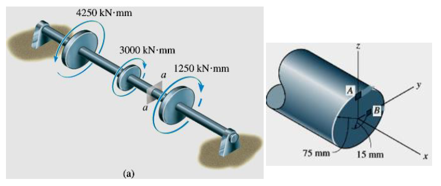
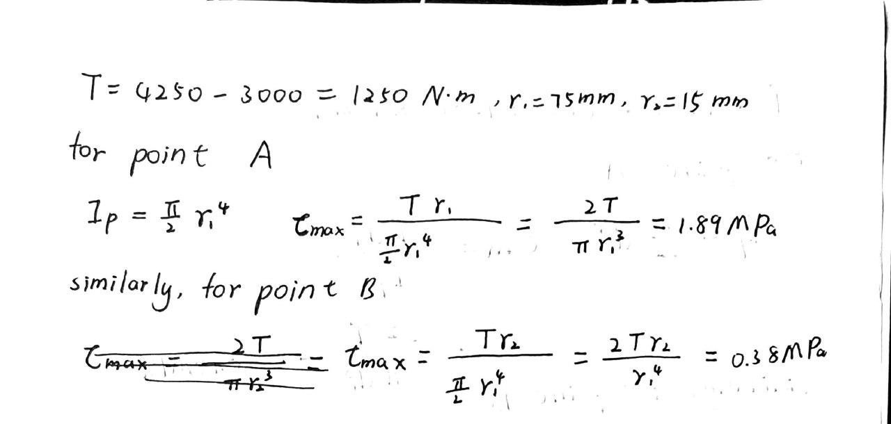
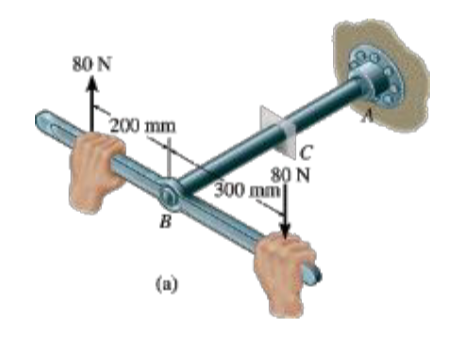
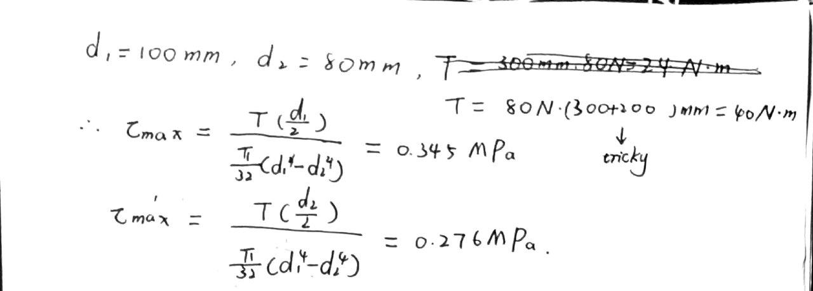
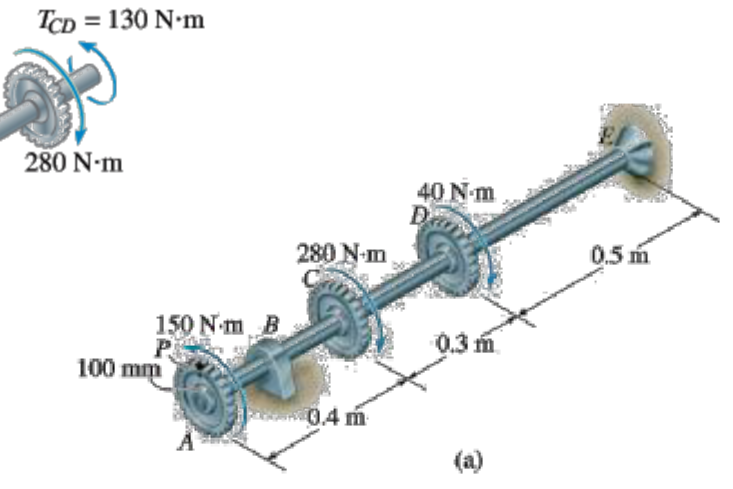
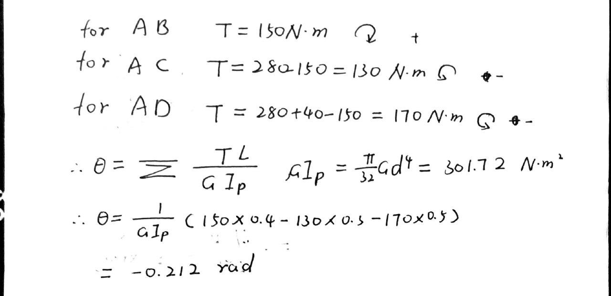
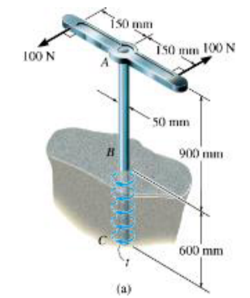
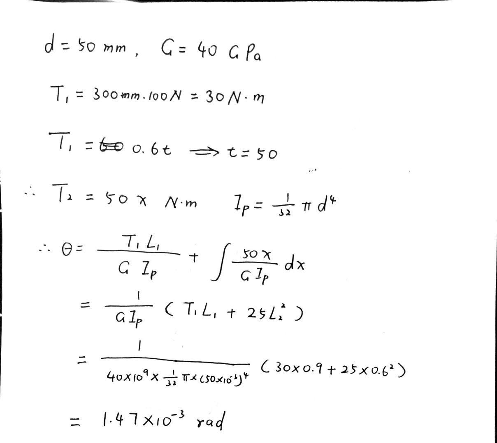
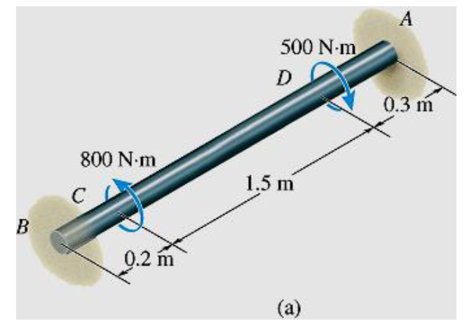
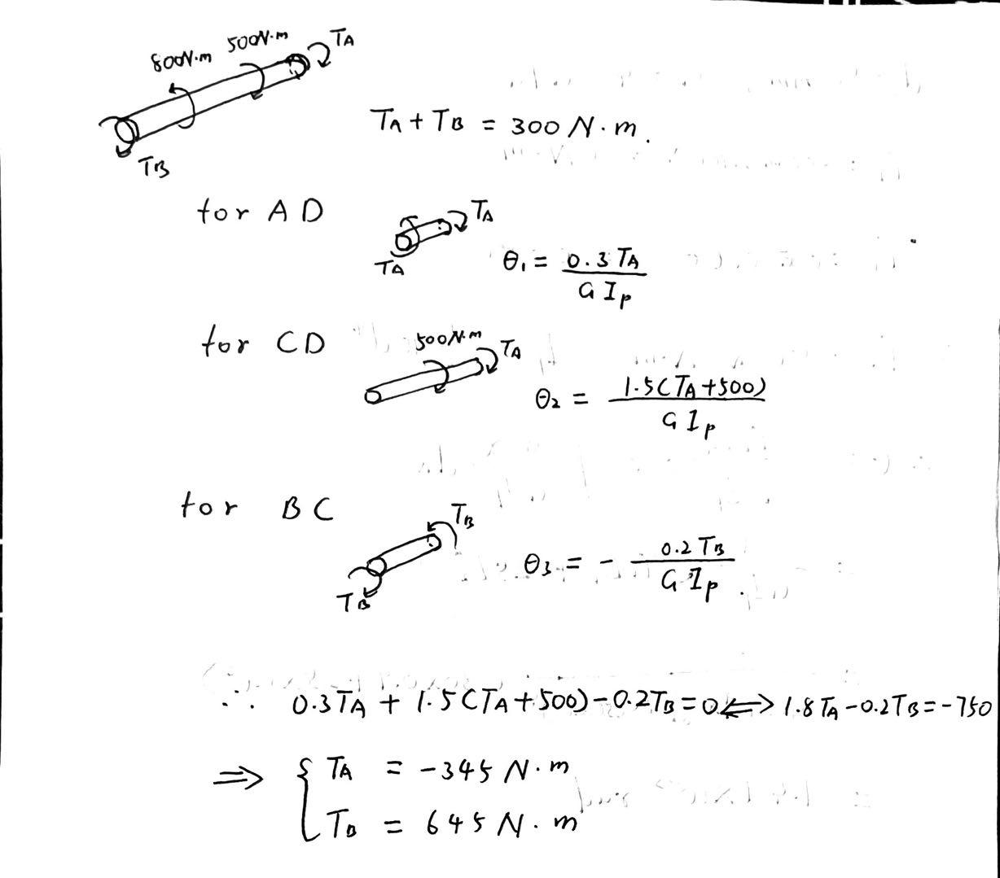

# EX_3

[TOC]

## EX 3.1

Shaft shown supported by two bearings and subjected to three torques. Determine shear stress developed at points A and B, located at section a-a of the shaft.

## EX 3.2

The pipe shown below has an inner diameter of 80 mm and an outer diameter pf 100 mm. If its end is tightened against the support at A using a torque wrench at B, determine the shear stress developed in the material at the inner and outer walls along the central portion of the pipe when the 80 N forces are applied to the wrench.

## EX 3.3

The gears attached to the fixed-end steel shaft are subjected to the torques shown in the figure below. If the shear modulus of elasticity is G = 80 GPa and the shaft has diameter of 14 mm, determine the displacement of the tooth P \on gear A. The shaft turns freely within the bearing at B.

## EX 3.4

50-mm-diameter solid cast-iron post shown is buried 600 mm in soil. Determine maximum shear stress in the post and angle of twist at its top. Assume torque about to turn the post, and soil exerts uniform torsional resistance of t N·mm/mm along its 600 mm buried length. $G = 40(10^3)$ MPa

## EX 3.5

Solid steel shaft shown has a diameter of 20 mm. If it is subjected to two torques, determine reactions at fixed supports A and B.

