# EX_4

[TOC]

## EX 4.1

A simply supported beam loads P and M0 Determine V and M at:

(a) just to the left of the beam's midian
(b) just to the right of the beam's midian

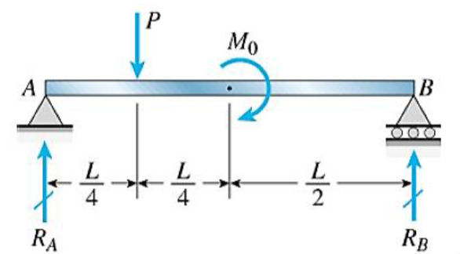

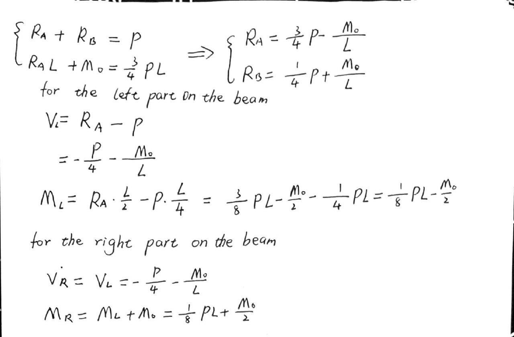

## EX 4.2

Calculate V and M at point D

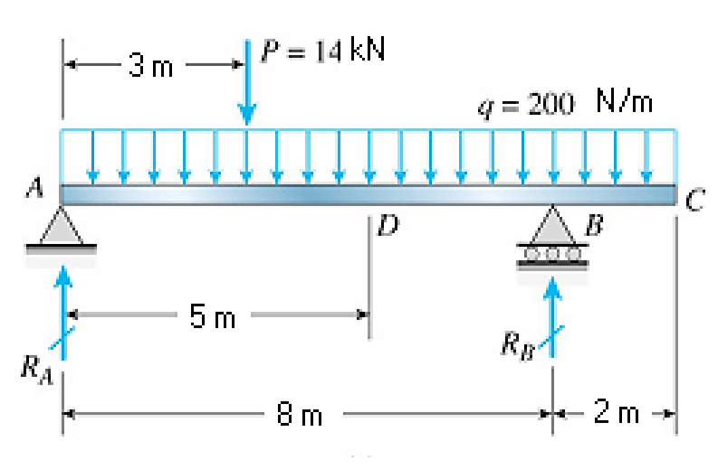

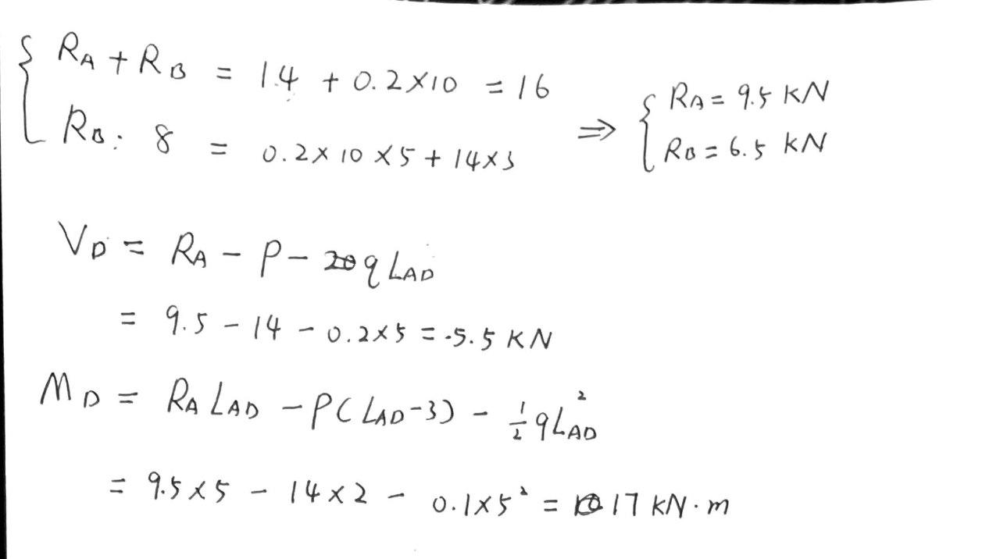

## EX 4.3

Draw the shear and moment diagrams for beam shown below.

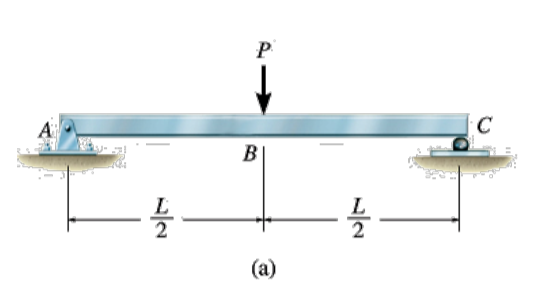

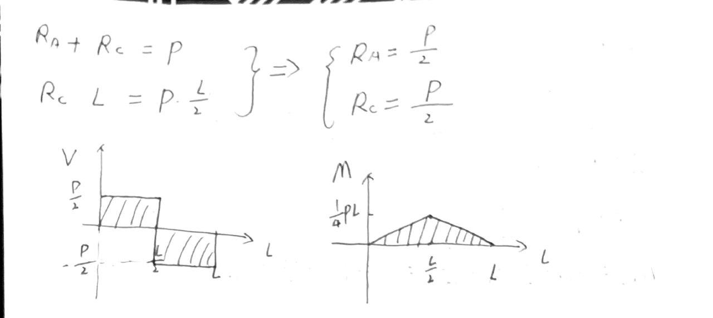

## EX 4.4

Draw the shear and moment diagrams for beam shown below.

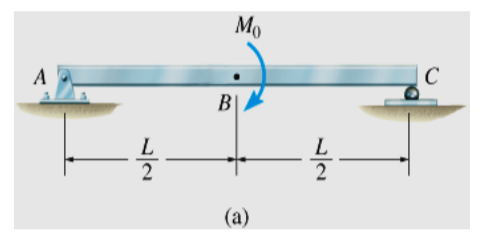

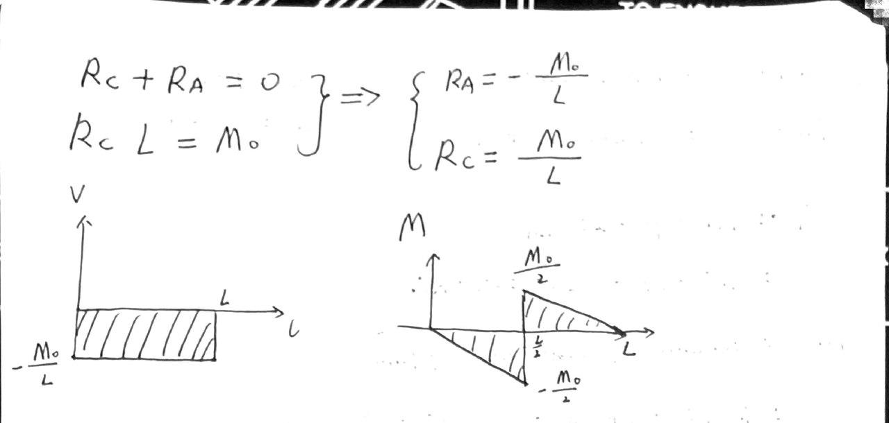

## EX 4.5

Draw the shear and moment diagrams for beam shown below.

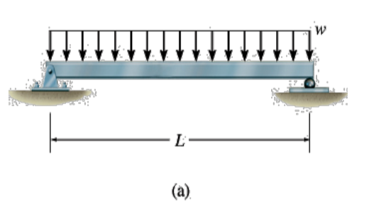

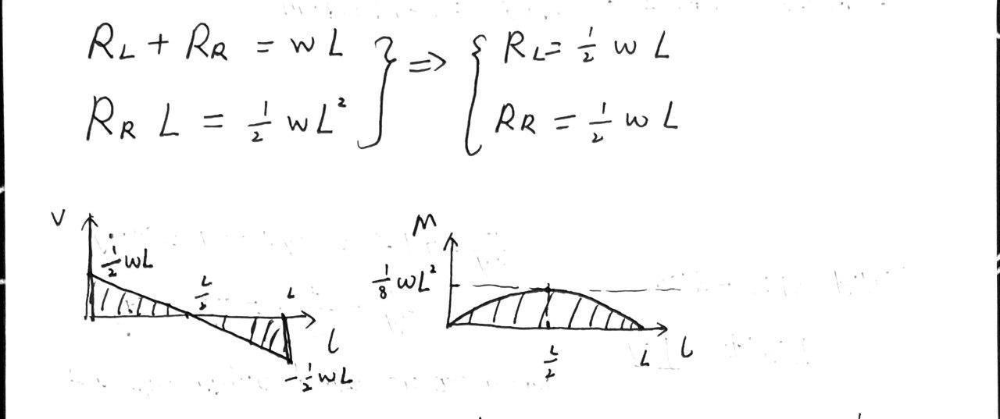

## EX 4.6

Draw the shear and moment diagrams for beam shown below.

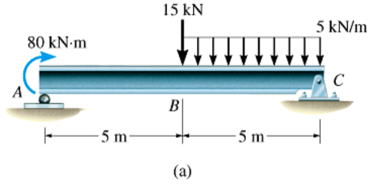

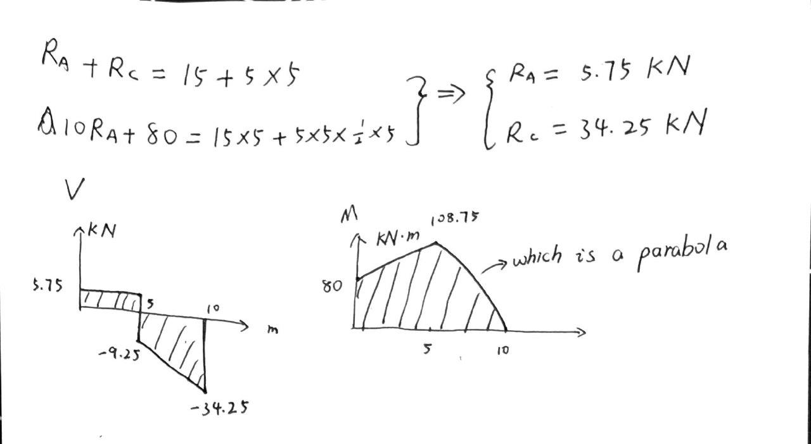

## EX 4.7

Draw the shear and moment diagrams for beam shown below.

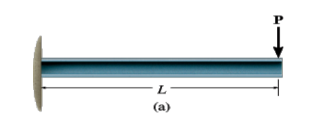

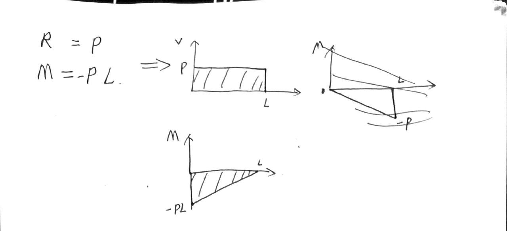

## EX 4.8

Draw the shear and moment diagrams for beam shown below.

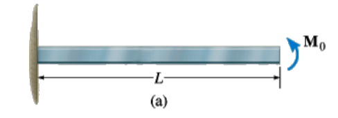

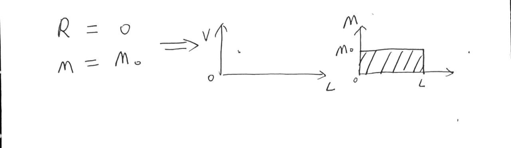

## EX 4.9

Draw the shear and moment diagrams for beam shown below.

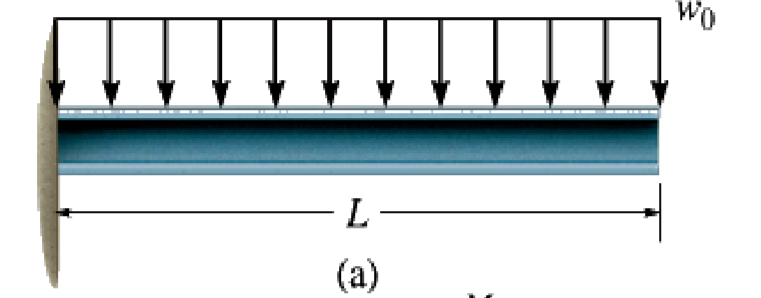

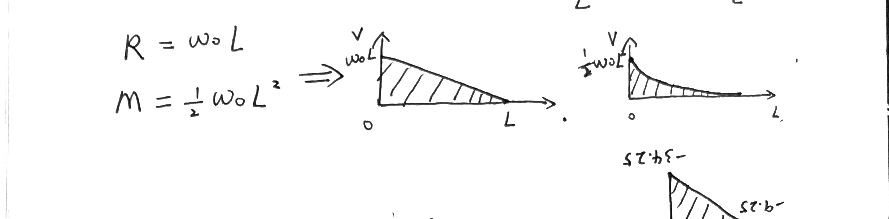

## EX 4.10

Draw the shear and moment diagrams for beam shown below.

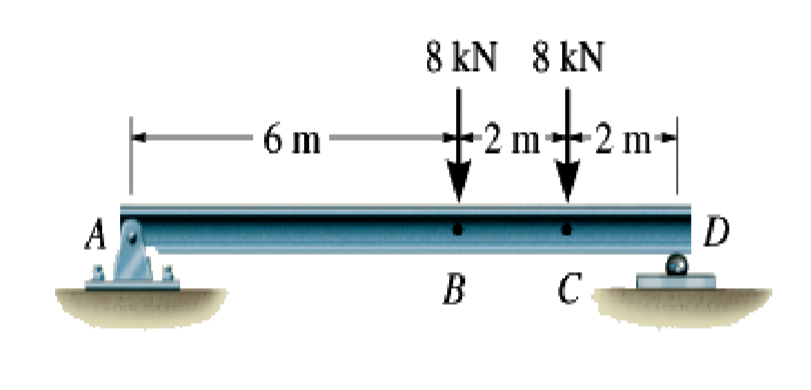

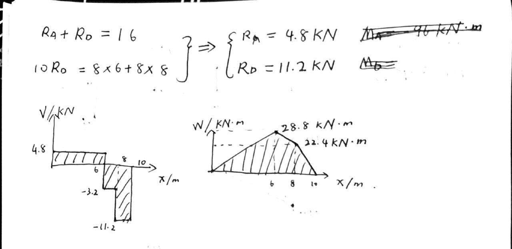

## EX 4.11

Draw the shear and moment diagrams for beam shown below.

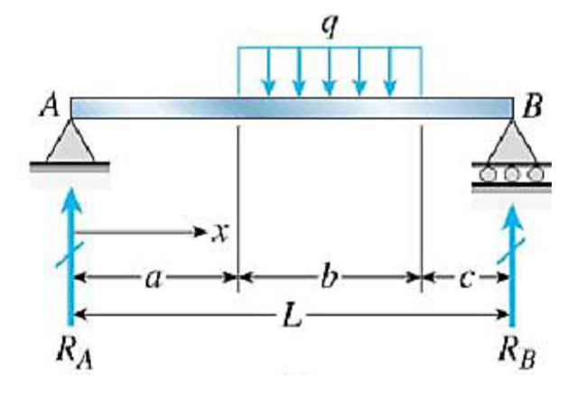

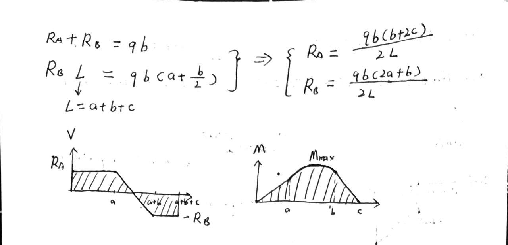

