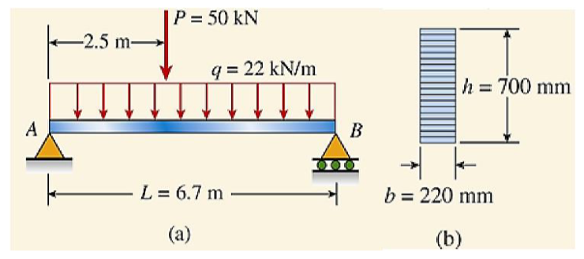
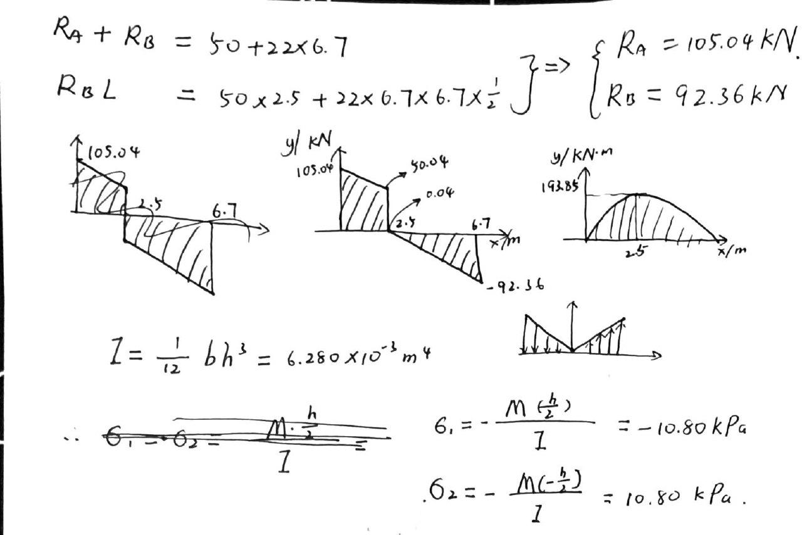
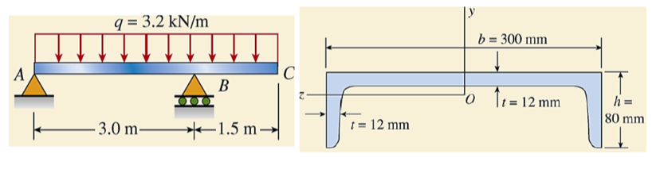
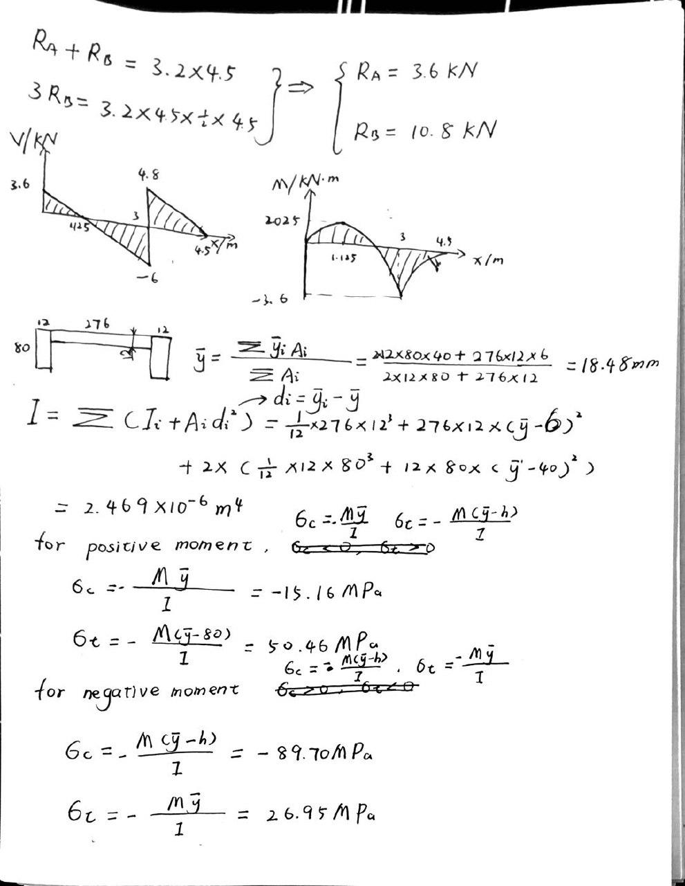
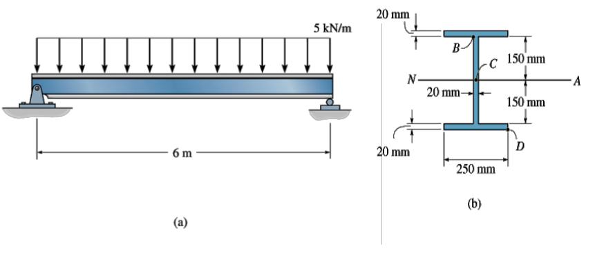
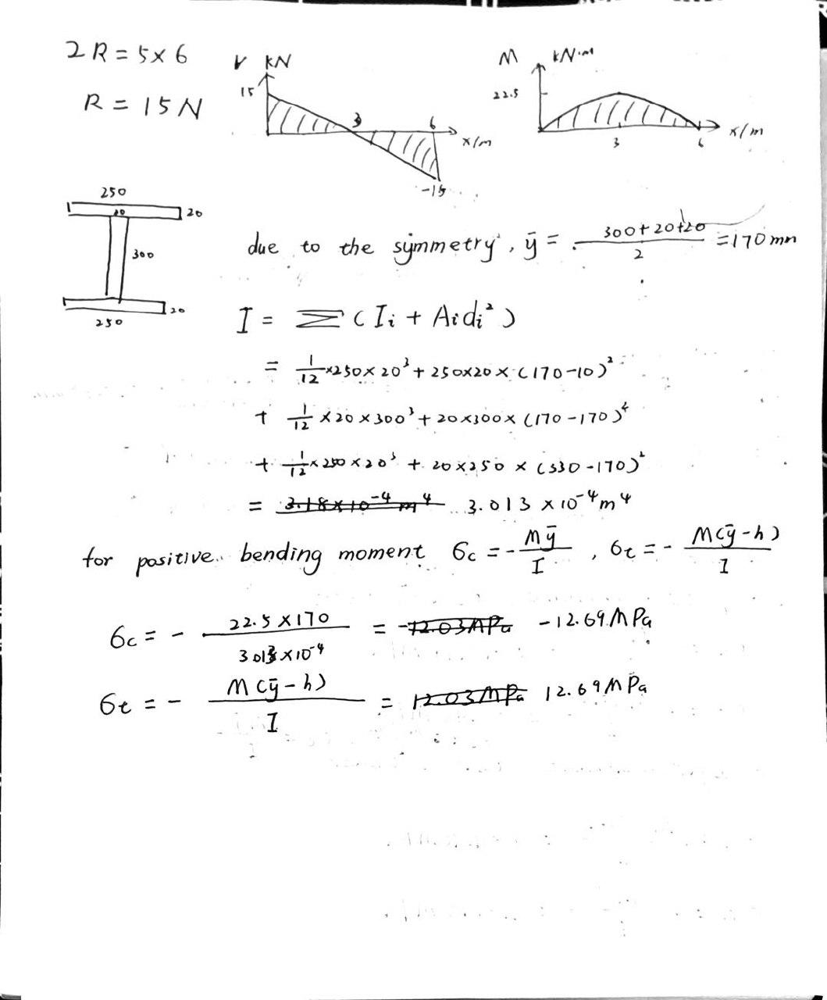
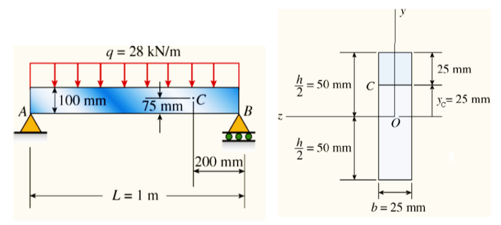
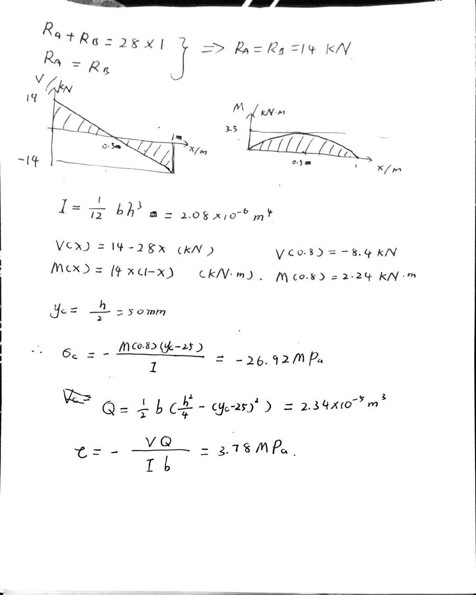
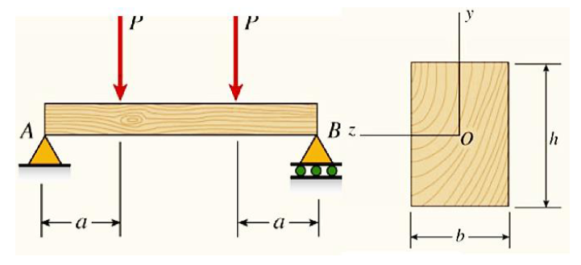
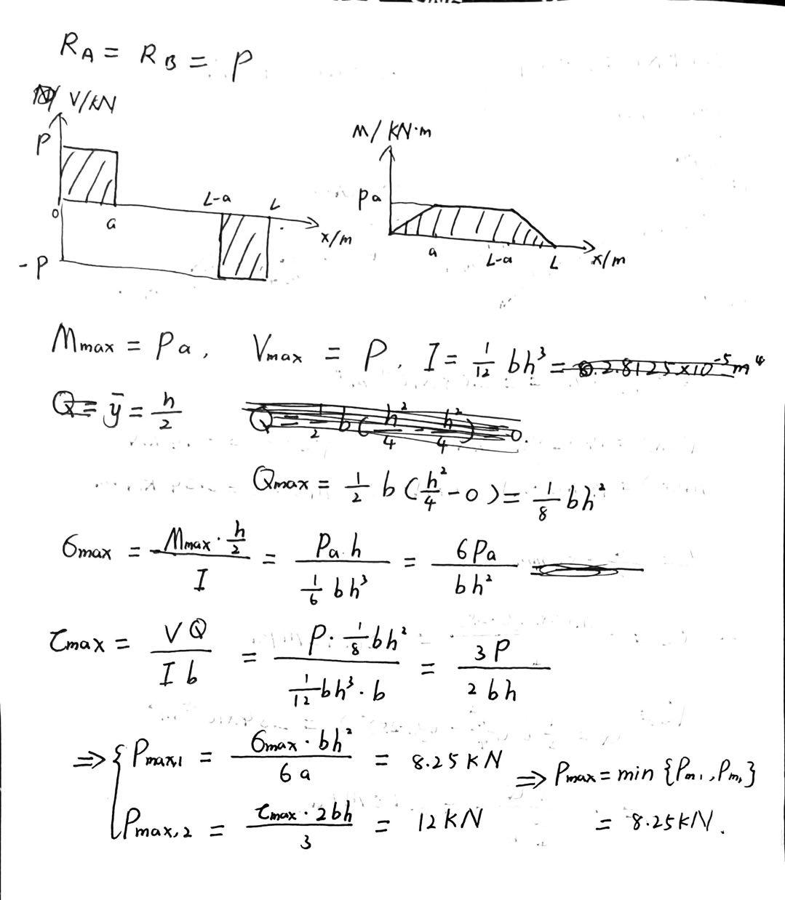

# EX_5

[TOC]

## EX 5.1

A simple beam AB of span length L=6.7m supports a uniform load of intensity q=22kN/m and a concentrated load P=50kN. The concentrated load acts at a point 2.5 m from the left-hand end of the beam. The beam is constructed of glued laminated wood and has a cross section of width b=220mm and height h=700mm. 

Determine the maximum tensile and compressive stresses in the beam due to loading.

## EX 5.2

The beam ABC has simple supports at A and B and an overhang from B to C. The length of the span is 3 m and the length of the overhang is 1.5 m. A uniform load of intensity q=3.2 kN/m acts throughout the entire length of the beam. The beam has a cross section of channel shape. 

Determine the maximum tensile and compressive stresses in the beam due to loading.

## EX 5.3

The simply supported beam in the following figure (a) has the cross-sectional area shown in figure (b). 

Determine the absolute maximum bending stress in the beam and draw the stress distribution over the cross section at this location.

## EX 5.3 (torsion)

A metal beam with span L = 1 m is simply supported at points A and B. The uniform load on the beam is q=28 kN/m. The cross section of the beam is rectangular with width b=25 mm and height h=100 mm. 

Determine the normal stress $\sigma_C$ and shear stress $\tau_C$ at point C, which is located 25 mm below the top of the beam and 200 mm from the righthand support. Show these stresses on a sketch of a stress element at point C.

## EX 5.4

A wood beam AB supporting two concentrated loads P has a rectangular cross section of width b=100 mm and height h=150 mm. The distance from each end of the beam to the nearest load is a=0.5m.

Determine the maximum permissible value $P_{max}$ of the loads if the allowable stress in bending is $\sigma_{allow}=11 MPa$ and the allowable stress in horizontal shear is $\tau_{allow}=1.2 MPa$.

