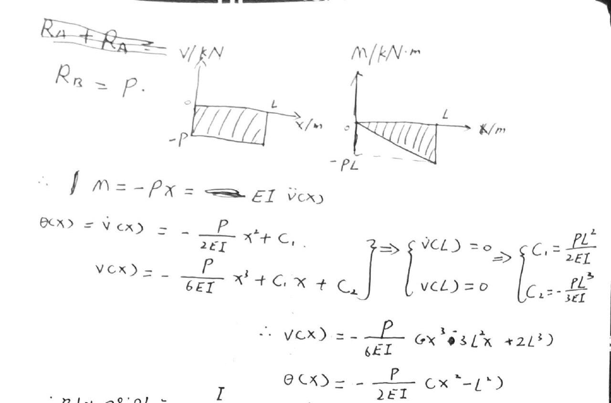

# EX_9

[TOC]

## EX 9.1

Cantilevered beam shown is subjected to a vertical load P at its end. Determine the equation of the elastic curve. EI is constant.

## EX 9.3 (9.2 missing)

The simply supported beam shown in the following figure is subjected to the concentered force P.

Determine the maximum deflection of the beam.

## EX 9.4

Beam is subjected to load P at its end. Determine the displacement at C. EI is a constant.

